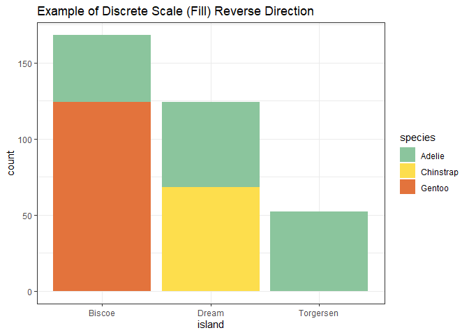

<!-- README.md is generated from README.Rmd. Please edit that file -->

# dye

Dye is substance generally used to impart colour to textiles, paper,
leather, and other materials.

<!-- badges: start -->
<!-- badges: end -->

The goal of `dye` is to attach a color palette to a `ggplot` object to
modify the default color and fill aesthetics. It can be used with both,
categorical/discrete and continuous scales. The package has 5 vibrant
colors to match the different types of dyes.

## Installation

You can install the development version of dye from
[here](https://github.com/etc5523-2021/r-package-takehome-pjai0005.git).

steps to install dye package: • install.packages (“devtools”) • library
(devtools) • type `install.packages("dye")` command on your R studio
console. • load the library : `library(dye)`

``` r
devtools::install_github("etc5523-2021/r-package-takehome-pjai0005")
```

## Example

This is a basic example which shows you how to solve a common problem:

``` r
library(dye)
library(tidyverse)
library(ggplot2)
library(palmerpenguins)
```

### For Colour Aesthetic

``` r
## basic example code for dye package

ggplot(penguins, aes(bill_depth_mm, bill_length_mm, color = species)) +
  geom_point( size = 3 ) +
  theme_bw()+
  scale_color_pentagon_d() +
  ggtitle("Example of Discrete Scale (Color)")
```


``` r
## basic example code with direction of colours reversed

ggplot(penguins, aes(bill_depth_mm, bill_length_mm, color = species)) +
  geom_point( size = 3 ) +
  theme_bw()+
  scale_colour_pentagon_d(direction = -1) +
  ggtitle("Example of Discrete Scale (Colour)")
```


### For Fill Aesthetic

``` r
## basic example code of fill scales

ggplot(penguins, aes(island, fill = species)) +
  geom_bar() +
  theme_bw()+
  scale_fill_pentagon_d() +
  ggtitle("Example of Discrete Scale (Fill)")
```


``` r
## code for fill scales with direction of colours reversed

ggplot(penguins, aes(island, fill = species)) +
  geom_bar() +
  theme_bw()+
  scale_fill_pentagon_d(direction = -1)  +
  ggtitle("Example of Discrete Scale (Fill) Reverse Direction")
```



### For Continuous Scales

``` r
## code of continuous scales with different colour from the palette

ggplot(penguins, aes(flipper_length_mm, body_mass_g, color = bill_depth_mm)) +
  geom_point( size = 3 ) +
  theme_bw()+
  scale_color_pentagon_seq_c("Indigo Blue") +
  ggtitle("Example of Continuous Scale")
```


``` r
## code for continuous scales  with the default colour and direction of colours reversed

ggplot(penguins, aes(flipper_length_mm, body_mass_g, color = bill_depth_mm)) +
  geom_point( size = 3 ) +
  theme_bw()+
  scale_colour_pentagon_seq_c(direction = -1) +
  ggtitle("Example of Continuous Scale Reverse")
```


#### Note: these functions work with both spellings i,e. `colour` and `color`.
