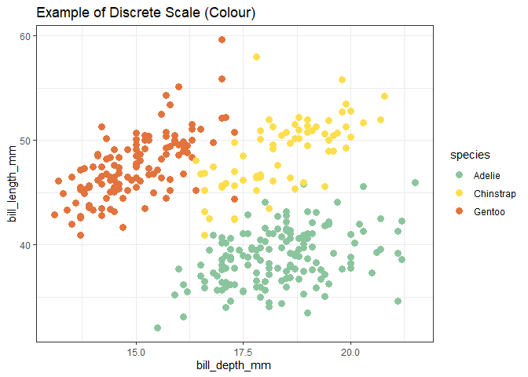

<!-- README.md is generated from README.Rmd. Please edit that file -->

# packageName

<!-- badges: start -->
<!-- badges: end -->

The goal of packageName is to …

## Installation

You can install the development version of packageName with …

``` r
remotes::install_github("etc5523-2021/r-package-takehome-pjai0005")
```

## Example

This is a basic example which shows you how to solve a common problem:

``` r
library(dye)
#> Loading required package: tidyverse
#> -- Attaching packages --------------------------------------- tidyverse 1.3.1 --
#> v ggplot2 3.3.5     v purrr   0.3.4
#> v tibble  3.1.4     v dplyr   1.0.7
#> v tidyr   1.1.3     v stringr 1.4.0
#> v readr   2.0.1     v forcats 0.5.1
#> -- Conflicts ------------------------------------------ tidyverse_conflicts() --
#> x dplyr::filter() masks stats::filter()
#> x dplyr::lag()    masks stats::lag()
library(tidyverse)
library(ggplot2)
library(palmerpenguins)

## basic example code

ggplot(penguins, aes(bill_depth_mm, bill_length_mm, color = species)) +
  geom_point( size = 3 ) +
  theme_bw()+
  scale_color_pentagon_d() +
  ggtitle("Example of Discrete Scale")
#> Warning: Removed 2 rows containing missing values (geom_point).
```


``` r
ggplot(penguins, aes(bill_depth_mm, bill_length_mm, color = species)) +
  geom_point( size = 3 ) +
  theme_bw()+
  scale_colour_pentagon_d() +
  ggtitle("Example of Discrete Scale")
#> Warning: Removed 2 rows containing missing values (geom_point).
```



``` r
ggplot(penguins, aes(island, fill = species)) +
  geom_bar() +
  theme_bw()+
  scale_fill_pentagon_d(direction = 1) +
  ggtitle("Example of Discrete Scale (Fill)")
```


``` r
penguins %>% filter(species == "Adelie") %>%
ggplot(aes(flipper_length_mm, body_mass_g, color = bill_depth_mm)) +
  geom_point( size = 3 ) +
  theme_bw()+
  scale_color_pentagon_seq_c() +
  ggtitle("Example of Continous Scale")
#> Warning: Removed 1 rows containing missing values (geom_point).
```


``` r
penguins %>% filter(species == "Adelie") %>%
ggplot(aes(flipper_length_mm, body_mass_g, color = bill_depth_mm)) +
  geom_point( size = 3 ) +
  theme_bw()+
  scale_colour_pentagon_seq_c() +
  ggtitle("Example of Continous Scale")
#> Warning: Removed 1 rows containing missing values (geom_point).
```


